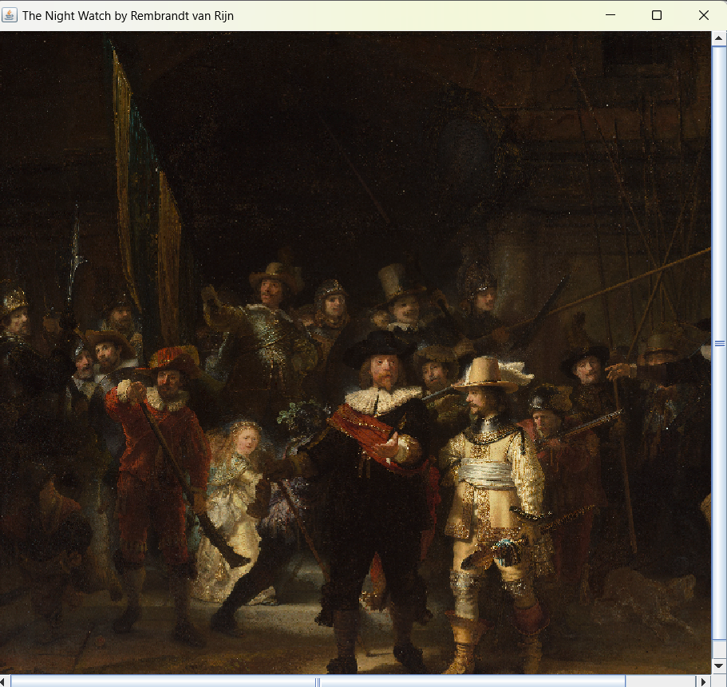
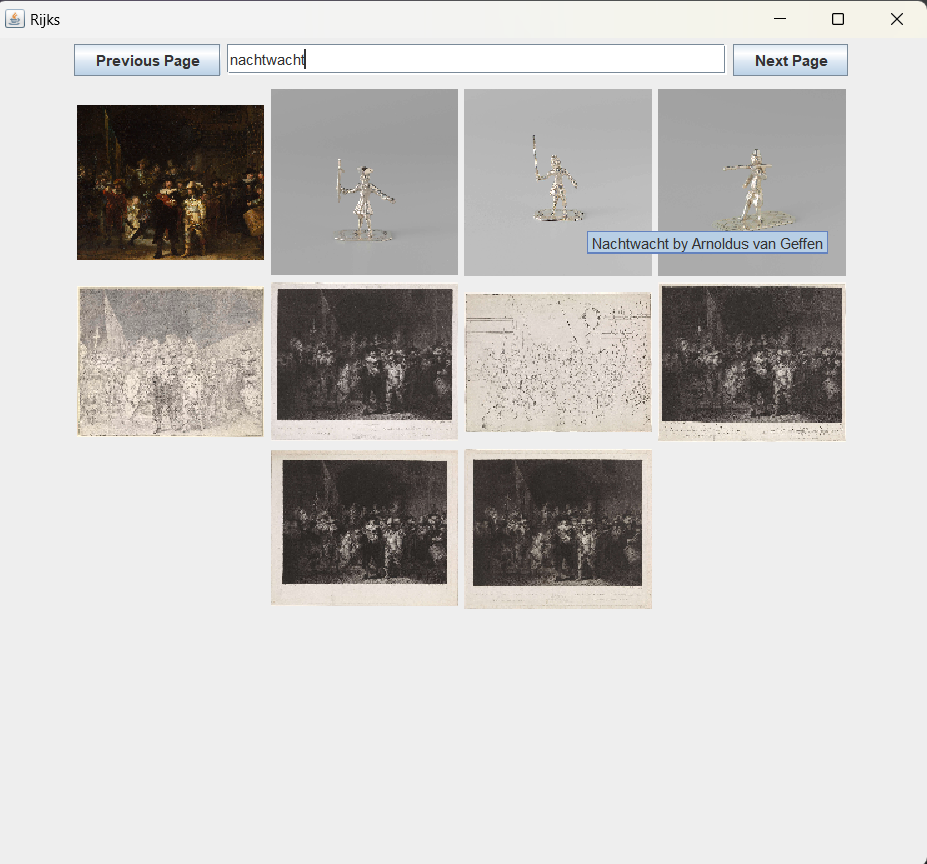

# Rijks Museum Service

## Overview
This program uses the Rijks Service API to access data from the Rijks Museum.
It shows different paintings in the museum with information about each paiting.

## GUI
The gui shows 10 images at a time. 

When the use presses "next page", 10 new images show up from the next page. 

When the user presses "previous page", 10 images show up from the previous page.

When the use hovers over an image, the title and artist show up.

When the user clicks on an image, the enlarged version shows up.

When a user puts a request into the search bar, related images show up.

### Links

[Rijks Museum](https://www.rijksmuseum.nl/en)

[Rijks API Data](https://data.rijksmuseum.nl/object-metadata/api/)